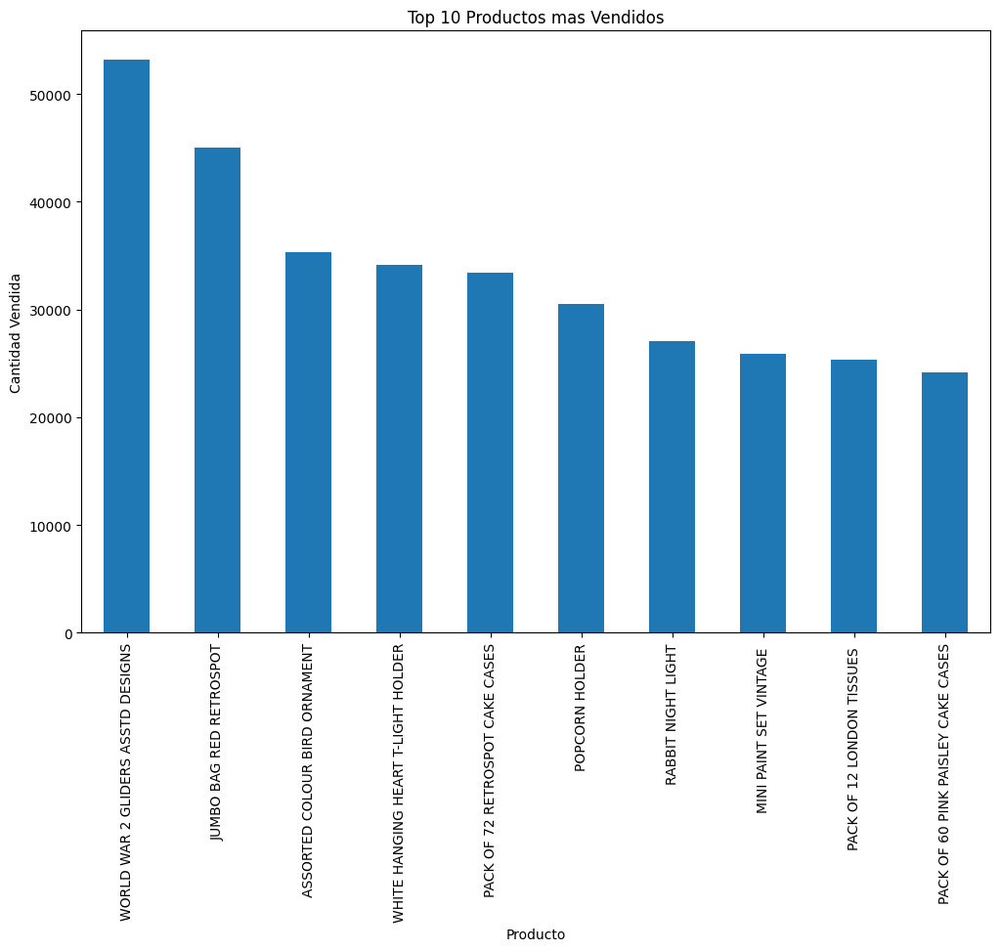
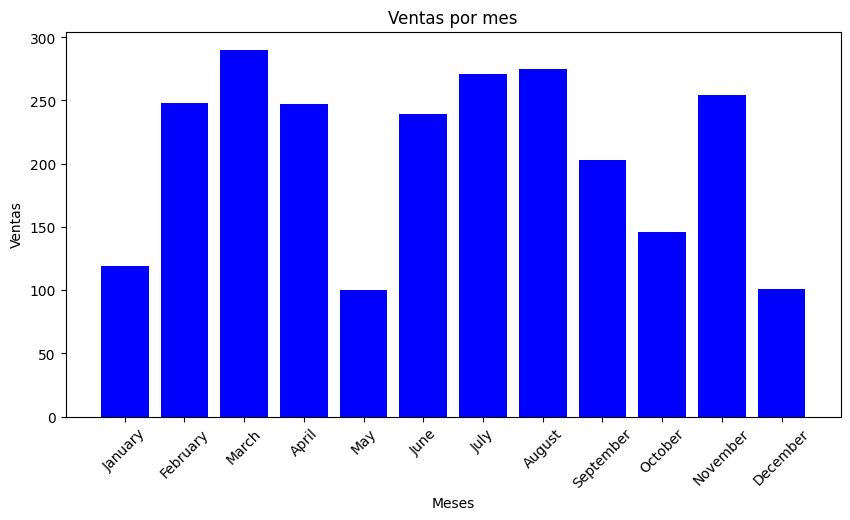
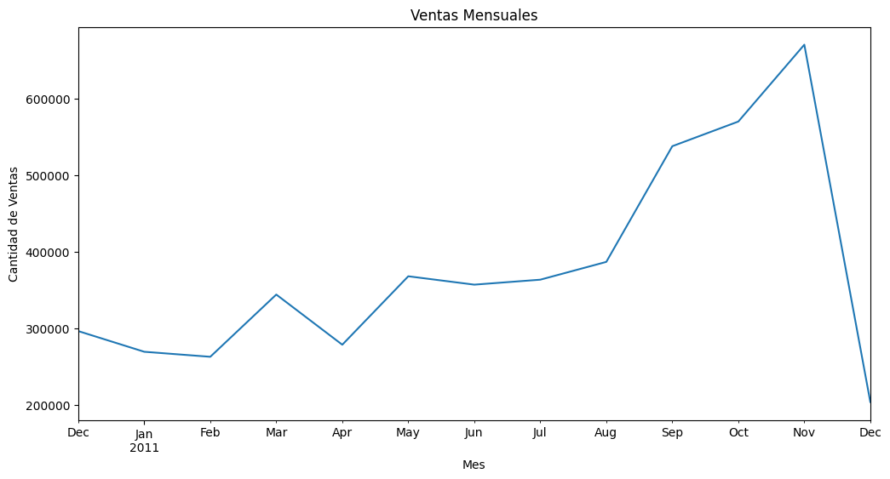

# 📊 Retail Data Analysis

## 📝 Project Overview
This project is a comprehensive data analysis of an online retail dataset. The main objective is to extract valuable insights that can assist stakeholders in making data-driven decisions. The project involves data cleaning, exploratory data analysis (EDA), and visualization using Python libraries such as Pandas, Matplotlib, and NumPy.

## ✨ Features
- **🧹 Data Cleaning**: Removal of null values, duplicate records, and incorrect data to ensure data integrity.
- **🔍Exploratory Data Analysis (EDA)**: Detailed analysis to uncover patterns, trends, and relationships within the data.
- **📊Data Visualization**: Effective use of graphs and charts to communicate findings clearly.
- **📑Reporting**: Summarized insights presented in a structured format, easily interpretable by non-technical stakeholders.

## Visualizaciones

### 🥇 Top 10 Productos Más Vendidos


### 💰 Ventas Totales por País


### 📅 Ventas por Mes


### 📈 Ventas Mensuales (Tendencia)



## 📔 Google Colab Notebook
For an interactive experience, you can access the notebook directly on Google Colab using the following link:
[](https://colab.research.google.com/drive/1AukJXlW67UbIDwfu91Txu8e2c2b6pdgo?usp=sharing)


## 📁 Project Structure
- **📓 Retail-Data-Analysis.ipynb**: The main Jupyter Notebook containing the entire analysis, from data cleaning to visualization.
- **📄 resumen_analisis.json**: A JSON file summarizing the key findings from the analysis.

## Getting Started
To replicate this project on your local machine, follow these steps:

1. 🚀 Clone the repository:
   ```bash
   git clone https://github.com/Gabmax4/Retail-Data-Analysis.git

2. Navigate to the project directory:
    ```bash
    cd Retail-Data-Analysis
3. Install the required packages:
    ```bash
    pip install numpy pandas matplotlib
4. Open the Jupyter Notebook:
    ```bash
    jupyter notebook Retail-Data-Analysis.ipynb

#### 📈 Insights
- **🌍 Total Sales by Country**: Visualized to identify the most profitable markets.
- **🏆 Top Selling Products**: Analyzed to understand customer preferences.
- **📅Monthly Sales Trends**: Tracked to detect seasonal patterns.

#### 🔮 Future Work
- Implement machine learning models to predict future sales trends.
- Expand the analysis to include customer segmentation.

#### 🤝 Connect with Me
If you have any questions or would like to connect, feel free to reach out via LinkedIn:
[LinkedIn Profile](https://www.linkedin.com/in/gabriel-maxemin-ramirez-231004147/)